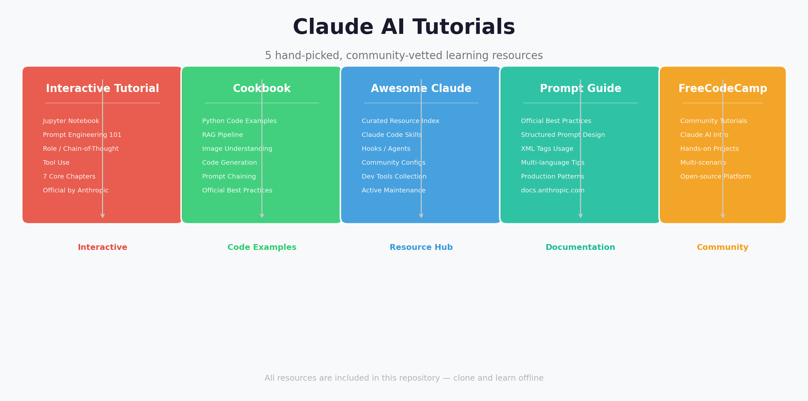

<p align="center">
  
</p>

<p align="center">
  <strong>Claude AI 教程合集</strong> — 5 个广受好评的学习资源，带你从入门到精通
  <br>
  <sub>📥 离线可用 · 克隆即学 · 持续更新</sub>
</p>

<p align="center">
  
  
  
</p>

---

## 📋 目录

- [概览](#-概览)
- [教程清单](#-教程清单)
  - [1. Prompt Engineering Interactive Tutorial](#1-prompt-engineering-interactive-tutorial)
  - [2. Anthropic Cookbook](#2-anthropic-cookbook)
  - [3. Awesome Claude Code](#3-awesome-claude-code)
  - [4. Prompt Engineering Guide](#4-prompt-engineering-guide)
  - [5. FreeCodeCamp Claude Tutorials](#5-freecodecamp-claude-tutorials)
- [快速开始](#-快速开始)
- [项目结构](#-项目结构)
- [许可证](#-许可证)

---

## 🗺 概览

本仓库收录了 5 个口碑最佳的 Claude AI 学习资源，涵盖从官方教程到社区精选的完整学习路径：

| # | 教程 | 类型 | 来源 | 适合人群 |
|---|------|------|------|----------|
| 1 | **Prompt Engineering Interactive Tutorial** | 📓 Jupyter Notebook | Anthropic 官方 | 初学者、想系统学习提示词工程者 |
| 2 | **Anthropic Cookbook** | 💻 Python 代码示例 | Anthropic 官方 | 开发者、API 集成者 |
| 3 | **Awesome Claude Code** | 🔗 精选资源索引 | 社区 (hesreallyhim) | Claude Code 使用者、效率追求者 |
| 4 | **Prompt Engineering Guide** | 📖 官方文档 | docs.anthropic.com | 所有用户、追求最佳实践者 |
| 5 | **FreeCodeCamp Claude Tutorials** | 🌐 社区教程页 | freecodecamp.org | 偏好动手实践的学习者 |

---

## 📚 教程清单

### 1. Prompt Engineering Interactive Tutorial

<p align="center">
  
  
  
</p>

Anthropic 官方出品的交互式提示词工程教程，以 Jupyter Notebook 形式呈现，手把手带你掌握 Claude 的提示词技巧。

**核心内容：**

- **基础提示结构** — 理解 Claude 的输入/输出格式
- **清晰直接的指令** — 如何写出高效的提示词
- **角色提示** — 为 Claude 分配角色以提升回答质量
- **数据与指令分离** — 结构化输入的最佳实践
- **输出格式化** — 控制 Claude 的输出格式
- **思维链** — 让 Claude 逐步推理复杂问题
- **少样本提示** — 用示例引导 Claude 输出

**使用方式：**

```bash
cd 1-prompt-eng-interactive-tutorial
# 启动 Jupyter
pip install jupyter && jupyter notebook
# 或直接浏览 Notebook 的 HTML 渲染版本
```

**目录结构：** `1-prompt-eng-interactive-tutorial/Anthropic 1P/` 下包含 7 个 `.ipynb` 文件，按编号顺序学习。

---

### 2. Anthropic Cookbook

<p align="center">
  
  
  
</p>

Anthropic 官方维护的代码示例集，覆盖 Claude API 的主流应用场景，每个示例都是可直接运行的 Python 代码。

**核心内容：**

| 场景 | 说明 |
|------|------|
| 🔍 **RAG (检索增强生成)** | 将外部知识库与 Claude 结合 |
| 🖼 **图像理解** | 用 Claude 分析图片内容 |
| 💬 **提示链** | 多步骤复杂任务编排 |
| ⌨️ **代码生成** | 利用 Claude 生成和审查代码 |
| 🛠 **工具调用** | 让 Claude 调用外部函数/API |
| 📝 **文本处理** | 摘要、翻译、改写等 |

**使用方式：**

```bash
cd 2-anthropic-cookbook
pip install -r requirements.txt
# 按需运行任意示例
python cookbook/rag_example.py
```

> 💡 每个示例都有详细的注释说明，建议对照官方文档学习。

---

### 3. Awesome Claude Code

<p align="center">
  
  
  
</p>

社区维护的 Claude Code 精选资源大全，汇集了最实用的 Skills、Hooks、Slash Commands 和 Agent 配置模板。

**核心内容：**

- 🧩 **Skills** — 可直接复用的技能模板
- 🪝 **Hooks** — Git hooks 集成方案
- ⚡ **Slash Commands** — 常用快捷命令
- 🤖 **Agent 配置** — 不同场景的 Agent 配置示例
- 🔧 **开发工具** — VS Code 集成、CI/CD 配置等

**使用方式：**

```bash
cd 3-awesome-claude-code
# 浏览 README.md 获取完整资源列表
cat README.md
```

---

### 4. Prompt Engineering Guide

<p align="center">
  
  
  
</p>

Anthropic 官方提示词工程指南的本地快照，涵盖了编写高质量提示词的核心原则和最佳实践。

**核心内容：**

- 提示词设计原则
- 结构化提示（XML 标签、分隔符）
- 角色设定技巧
- 多语言和跨文化提示
- 错误处理和回退策略
- 生产环境最佳实践

**使用方式：**

浏览器直接打开 `4-prompt-engineering-guide.html` 即可阅读。

---

### 5. FreeCodeCamp Claude Tutorials

<p align="center">
  
  
  
</p>

FreeCodeCamp 上关于 Claude AI 的教程搜索结果索引，汇集了来自开源学习社区的优质教程。

**使用方式：**

浏览器直接打开 `5-freecodecamp-claude-tutorials.html` 浏览教程列表。

---

## 🚀 快速开始

```bash
# 克隆本仓库
git clone https://github.com/tsingke/claude-tutorials.git
cd claude-tutorials

# 查看概览图
open assets/overview.png

# 选择你想学习的教程
# - 想系统学提示词 → 进入 1-prompt-eng-interactive-tutorial/
# - 想看代码示例 → 进入 2-anthropic-cookbook/
# - 想找资源合集 → 进入 3-awesome-claude-code/
# - 想看官方指南 → 打开 4-prompt-engineering-guide.html
# - 想看社区教程 → 打开 5-freecodecamp-claude-tutorials.html
```

---

## 📁 项目结构

```
claude-tutorials/
├── assets/
│   └── overview.png              # 项目概览图
├── 1-prompt-eng-interactive-tutorial/  # 📓 提示词工程交互教程
│   └── Anthropic 1P/
│       ├── 01_Basic_Prompt_Structure.ipynb
│       ├── 02_Being_Clear_and_Direct.ipynb
│       ├── 03_Assigning_Roles_Role_Prompting.ipynb
│       ├── 04_Separating_Data_and_Instructions.ipynb
│       ├── 05_Formatting_Output_and_Speaking_for_Claude.ipynb
│       ├── 06_Precognition_Thinking_Step_by_Step.ipynb
│       └── 07_Using_Examples_Few-Shot_Prompting.ipynb
├── 2-anthropic-cookbook/              # 👨‍🍳 Cookbook 代码示例
│   ├── cookbook/
│   ├── requirements.txt
│   └── README.md
├── 3-awesome-claude-code/             # ⭐ Awesome Claude 资源
│   └── README.md
├── 4-prompt-engineering-guide.html    # 📖 提示词指南 (离线 HTML)
├── 5-freecodecamp-claude-tutorials.html # 🌐 FC 教程索引 (离线 HTML)
├── README.md                          # 本文件
└── LICENSE                            # MIT 许可证
```

---

## 📄 许可证

本项目采用 MIT 许可证。各子教程的版权归其原始作者所有：

| 教程 | 许可证 | 版权方 |
|------|--------|--------|
| Prompt Engineering Interactive Tutorial | MIT | Anthropic |
| Anthropic Cookbook | MIT | Anthropic |
| Awesome Claude Code | MIT | hesreallyhim |
| Prompt Engineering Guide | © All Rights Reserved | Anthropic |
| FreeCodeCamp Tutorials | © All Rights Reserved | freeCodeCamp |

---

<p align="center">
  Made with ❤️ for the Claude AI community
  <br>
  <sub>如果觉得有用，点个 ⭐ 吧！</sub>
</p>
